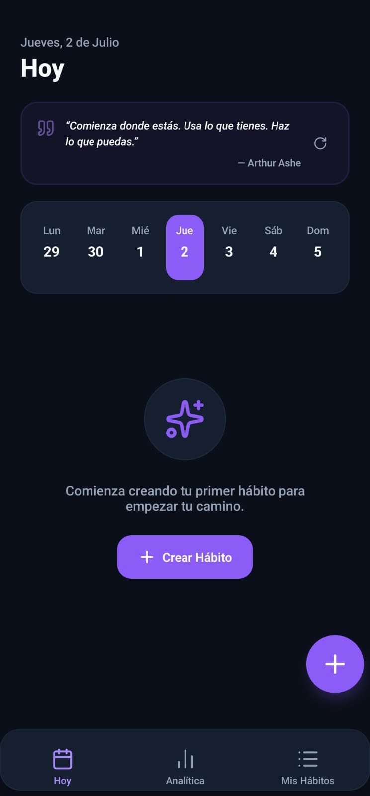
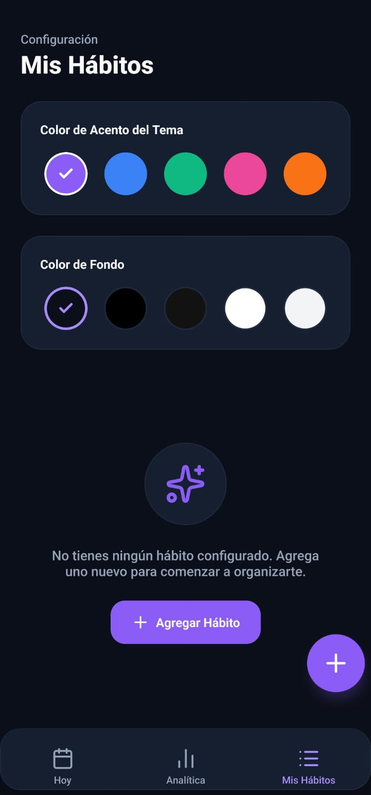
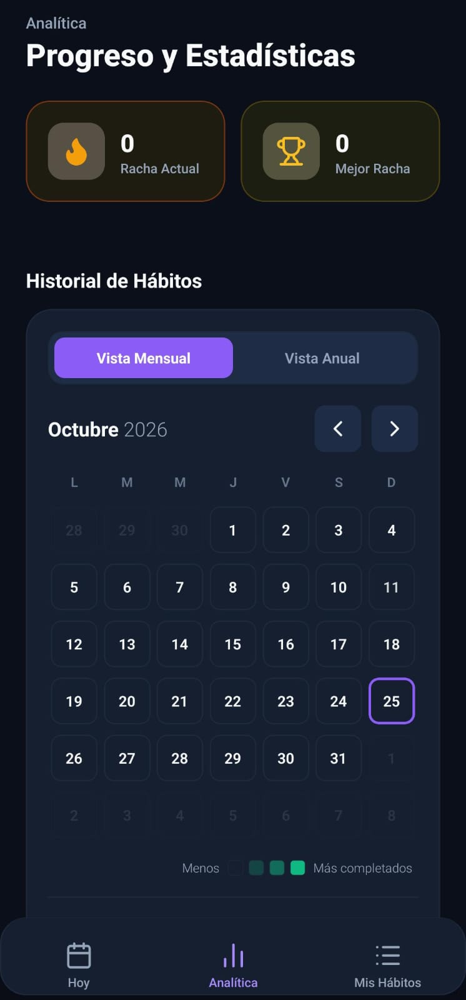

# 🏆 Habit Tracker

[](https://expo.dev/artifacts/eas/FiYqMVK_a5LKRjYZYrTBYj1CIPD4jIDTlZ4VJudi3Bw.apk)

Una aplicación móvil de seguimiento de hábitos construida con **React Native** y **Expo**, diseñada para ayudarte a construir rutinas positivas, evitar hábitos negativos y medir tu progreso diario.

---

## ✨ Características

### 📋 Tipos de Hábitos
- **Positivos** — Hábitos que quieres construir (ej. leer, ejercitarse)
- **Negativos** — Hábitos que quieres evitar (ej. no fumar, no redes sociales)
- **Cuantitativos** — Hábitos con metas numéricas (ej. beber 2L de agua)

### 🗓️ Seguimiento Diario
- Tira semanal con indicadores de progreso por día
- Marcado rápido de hábitos desde el dashboard
- Controles `+` / `−` para hábitos cuantitativos
- Barra de progreso del día en tiempo real

### 📊 Estadísticas y Logros
- Racha global de días consecutivos exitosos
- Gráfico de tendencias semanales (% de éxito por día de la semana)
- Sistema de **8 logros/medallas** desbloqueables
- Rachas individuales por hábito 🔥

### 🎨 Personalización
- **5 temas de color** de acento: Violeta, Azul océano, Rosa, Verde esmeralda, Naranja
- **4 temas de fondo**: Oscuro, Negro, Blanco, Gris
- Categorías personalizadas con color e icono propios

### 💡 UX Premium
- Tarjeta motivacional con frases diarias (rotación manual 🔄)
- Filtros por tipo de hábito en el dashboard
- Banner de celebración al completar el 100% del día ✨
- Recordatorios con notificaciones locales programadas

---

## 🛠️ Tecnologías

| Tecnología | Versión |
|---|---|
| React Native | 0.86.0 |
| Expo SDK | ~57.0 |
| React Navigation | v7 |
| AsyncStorage | 2.2.0 |
| expo-notifications | ~57.0 |
| lucide-react-native | ^1.23.0 |
| react-native-safe-area-context | ~5.7.0 |

---

## 🚀 Instalación y Ejecución

### Prerrequisitos
- [Node.js](https://nodejs.org/) (v18+)
- [Expo CLI](https://docs.expo.dev/get-started/installation/)
- Aplicación **Expo Go** en tu dispositivo móvil

### Pasos

```bash
# 1. Clonar el repositorio
git clone https://github.com/manuelmoreno-dev/habit-tracker.git
cd habit-tracker

# 2. Instalar dependencias
npm install

# 3. Iniciar el servidor de desarrollo
npm start
```

Escanea el código QR con **Expo Go** (Android) o la cámara (iOS).

---

## 📁 Estructura del Proyecto

```
habit-tracker/
├── App.js                      # Punto de entrada y navegación
├── src/
│   ├── components/
│   │   ├── CalendarStrip.js    # Tira semanal con indicadores de progreso
│   │   ├── CategorySelector.js # Selector de categorías
│   │   ├── HabitCard.js        # Tarjeta interactiva de hábito
│   │   ├── MonthlyCalendar.js  # Calendario mensual
│   │   ├── ProgressBar.js      # Barra de progreso
│   │   └── StreakBadge.js      # Insignia de racha
│   ├── context/
│   │   └── HabitsContext.js    # Estado global y persistencia
│   ├── screens/
│   │   ├── HomeScreen.js       # Dashboard principal
│   │   ├── HabitsScreen.js     # Gestión de hábitos
│   │   ├── AddHabitScreen.js   # Crear / editar hábito
│   │   └── StatsScreen.js      # Estadísticas y logros
│   ├── theme/
│   │   └── colors.js           # Sistema de temas y colores
│   └── utils/
│       ├── dateHelpers.js      # Lógica de rachas y progreso
│       └── notificationHelpers.js  # Notificaciones locales
└── assets/                     # Íconos y splash screen
```

---

## 📥 Descarga e Instalación

### APK para Android

> **[⬇️ Descargar APK v1.0.0](https://expo.dev/artifacts/eas/FiYqMVK_a5LKRjYZYrTBYj1CIPD4jIDTlZ4VJudi3Bw.apk)**

**Pasos para instalar en tu dispositivo Android:**
1. Descarga el APK desde el enlace de arriba
2. En tu teléfono ve a **Ajustes → Seguridad → Instalar apps desconocidas** y actívalo
3. Abre el archivo `.apk` descargado e instala
4. ¡Listo! Busca **Habit Tracker** en tu menú de apps

---

## 📱 Capturas de Pantalla

| Dashboard | Configuración | Analítica |
|:---------:|:-------------:|:---------:|
|  |  |  |
| Tira semanal y frases motivacionales | Temas de color y fondo | Calendario y estadísticas |

---

## 📄 Licencia

Este proyecto fue desarrollado como proyecto universitario (PROJET II — UNI).

---

<div align="center">
  Hecho con ❤️ por <a href="https://github.com/manuelmoreno-dev">manuelmoreno-dev</a>
</div>
